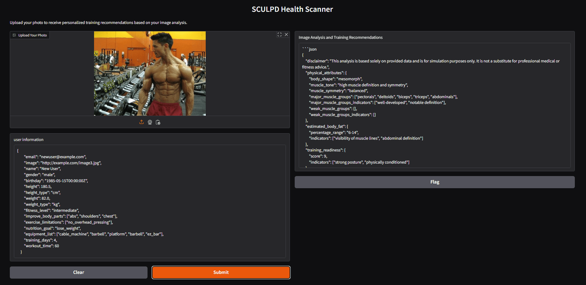

# SCULPD Scanner

Scanner microservise of SCULPD APP for fitness. 
This microservice is responsible for user photo (scan) description and first training recommendations.


## Prerequisites

- Docker
- 'configs/' directory with all necessary configs
- .env file for local running (with open-ai api key)
- .env.docker file for docker running (with open-ai api key)
- libs from requirements.txt
- open port 8888

## .env file example

``` dotenv
PORT=8888
API_KEY=YOUR_API_KEY_HERE
SCANNER_CONFIG_PATH=/app/configs/scanner_config.yaml
REPORT_PROCESSING_CONFIG_PATH=/app/configs/report_processing_config.yaml
```

## Build and run

```bash
docker-compose build 
docker-compose up -d
```


## API

API based on Fast API and has post endpoint '/generate_scanner_description'

Request payload:

```python
payload = {
    "user_info": "image url example",
    "image_url": {age: 39, height: 180}
}
```

Response example:

```python

scanner_output = {
    "disclaimer": "This analysis is based solely on the provided summary and is for simulation purposes only. It is not a substitute for professional medical or fitness advice. For personalized guidance, consulting with a fitness professional is recommended.",
    "physical_attributes": {
      "body_shape": "mesomorphic",
      "muscle_tone": "balanced with potential for improved definition",
      "muscle_symmetry": "balanced",
      "major_muscle_groups": ["chest", "shoulders"],
      "major_muscle_groups_indicators": ["well-developed"],
      "weak_muscle_groups": ["arms", "legs"],
      "weak_muscle_groups_indicators": ["potential focus needed on enhancing muscle hypertrophy"]
    },
    "estimated_body_fat": {
      "percentage_range": "15-20",
      "indicators": ["muscle definition cues"]
    },
    "training_readiness": {
      "score": 8,
      "indicators": ["upright posture", "high energy levels"]
    },
    "training_recommendations": {
      "body_development": {
        "upper_body": {
          "chest": ["bench presses", "push-ups"],
          "back": ["pull-ups", "rows"],
          "shoulders": ["shoulder presses", "lateral raises"],
          "arms": ["bicep curls", "triceps dips"]
        },
        "lower_body": {
          "legs": ["squats", "lunges"],
          "calves": ["calf raises"]
        },
        "core": ["planks", "back extensions"],
        "postural_balance": ["face pulls", "seated rows"]
      },
      "body_maintenance": {
        "upper_body": {
          "chest": ["bench presses", "push-ups"],
          "back": ["pull-ups", "rows"],
          "shoulders": ["shoulder presses", "lateral raises"],
          "arms": ["bicep curls", "triceps dips"]
        },
        "lower_body": {
          "legs": ["squats", "lunges"],
          "calves": ["calf raises"]
        },
        "core": {
          "exercises": ["planks", "back extensions"]
        },
        "postural_balance": {
          "exercises": ["face pulls", "seated rows"]
        }
      },
      "fat_loosing": {
        "cardiovascular": []
      }
    }
  }

```

## UI


